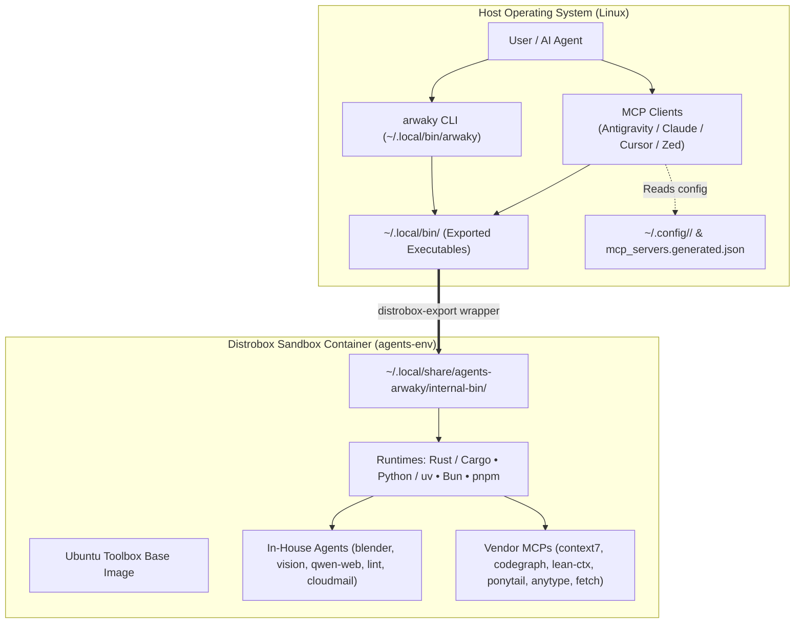

# agents-arwaky

<div align="center">


**A production-grade, sandboxed multi-agent ecosystem and unified Model Context Protocol (MCP) orchestrator.**

[Quickstart](#-quickstart-in-60-seconds) • [Architecture](#-architecture) • [CLI Reference](#-unified-orchestrator-cli-arwaky) • [Catalog](#-agent--tool-catalog) • [MCP Client Setup](#-mcp-client-integration) • [Contributing](#-contributing)

</div>

---

## 💡 Executive Summary

Modern autonomous AI workflows demand dozens of polyglot toolchains—Rust (`cargo`), Node (`pnpm`/`npm`), Bun, Python (`uv`), Playwright headless browsers, and system C-libraries. Installing these natively clutters the host operating system, introduces version conflicts, and creates security vulnerabilities.

**`agents-arwaky`** solves this through a **Distrobox First-Class Architecture**:
- 🛡️ **Zero Host Contamination:** Compilers, dependencies, and runtimes live inside an automated rootless container (`agents-env`). Your host OS stays clean.
- ⚡ **Seamless Host Execution:** Containerized executables are exported directly to `~/.local/bin/` via standard Linux XDG integration. Run tools from your host terminal with zero manual container switching.
- 🤖 **Universal MCP Hub:** Out-of-the-box support for leading AI interfaces (Google Antigravity, Claude Desktop, Cursor, Zed, Continue) via declarative, auto-generated MCP server configurations.
- 🎯 **Unified Orchestration (`arwaky` CLI):** One single control point for diagnostics, health checks, execution dispatching, and build pipelines.

---

## 📑 Table of Contents

- [Architecture](#-architecture)
  - [System Flow](#system-flow)
  - [Directory Layout](#directory-layout)
- [Quickstart in 60 Seconds](#-quickstart-in-60-seconds)
- [Unified Orchestrator CLI (`arwaky`)](#-unified-orchestrator-cli-arwaky)
- [Agent & Tool Catalog](#-agent--tool-catalog)
  - [Core In-House Agents (`internal/`)](#core-in-house-agents-internal)
  - [Curated Upstream Vendor Tools (`vendor/`)](#curated-upstream-vendor-tools-vendor)
- [MCP Client Integration](#-mcp-client-integration)
- [Developer Workflows](#-developer-workflows)
  - [Interactive Container Shell](#interactive-container-shell)
  - [Host / Bare-Metal Fallback](#host--bare-metal-fallback)
  - [Quality Gate & CI Verification](#quality-gate--ci-verification)
- [Security & Sandboxing Model](#-security--sandboxing-model)
- [Contributing](#-contributing)
- [License & Attribution](#-license--attribution)

---

## 🏛️ Architecture

### System Flow



### Directory Layout

```text
agents-arwaky/
├── arwaky                       # Main Orchestration Entrypoint CLI (Host executable)
├── distrobox.ini                # Declarative container specification (Podman/Docker)
├── Makefile                     # Standard developer commands (install, build, shell, test)
├── mcp_servers.generated.json   # Auto-generated unified MCP client manifest
├── THIRD_PARTY_LICENSES.md      # Upstream licensing compliance records
├── LICENSE                      # Project License (MIT)
│
├── internal/                    # In-House Autonomous Agents & Tools
│   ├── blender-arwaky/          # Headless 3D pipeline & rendering execution engine
│   ├── cloudmail-arwaky/        # Serverless mail agent on Cloudflare Workers
│   ├── lint-arwaky/             # Rust-based Architecture Enforcement System (AES)
│   ├── qwen-web-arwaky/         # Playwright-driven browser automation & MCP
│   └── vision-arwaky/           # Computer vision MCP (VLM, OCR, visual memory)
│
├── vendor/                      # Pinned Upstream Repositories (Git Submodules)
│   ├── anytype-mcp/             # Anytype desktop & sync integration
│   ├── codegraph/               # Codebase intelligence & graph query engine
│   ├── context7/                # Upstash documentation & context retrieval
│   ├── fetch-mcp/               # Fast, clean web scraping & text extraction
│   ├── graphify/                # Knowledge graph generation & analysis
│   ├── lean-ctx/                # High-efficiency token-lean codebase indexer
│   └── ponytail/                # Agent architecture patterns & instructions
│
└── tools/                       # Orchestration, CI & XDG Infrastructure
    ├── arwaky/                  # CLI engine implementation & tool manifest
    ├── build/                   # Master cross-compilation pipeline
    ├── ci/                      # Quality gates & syntax validation scripts
    ├── distrobox/               # Container provisioning & binary exporter
    ├── lib/                     # Shared bash utilities & XDG path helpers
    ├── mcp/                     # Multi-client MCP configuration generator
    └── <vendor-tool>/           # Per-tool installation & wrapper definitions
```

---

## 🚀 Quickstart in 60 Seconds

### 1. Clone with Submodules
```bash
git clone --recurse-submodules https://github.com/rakaarwaky/agents-arwaky.git
cd agents-arwaky
```

> [!TIP]
> If you previously cloned without submodules, initialize them via:
> ```bash
> make submodules
> ```

### 2. Verify Host Prerequisites
Ensure [Podman](https://podman.io/) (or Docker) and [Distrobox](https://distrobox.it/) are installed:
```bash
make setup
```
*(Runs an automated prerequisite check and optionally installs dependencies using your host package manager: `apt`, `pacman`, or `dnf`).*

### 3. Build & Provision (One-Command)
```bash
make install
```
This single command executes the end-to-end setup pipeline:
1. Validates host container runtime.
2. Creates the isolated `agents-env` Distrobox container from [`distrobox.ini`](distrobox.ini).
3. Provisions isolated runtimes (`uv`, `bun`, `pnpm`, `cargo`) inside the container.
4. Compiles all internal agents and vendor tools into containerized XDG prefixes.
5. Exports binary launchers to host `~/.local/bin/`.
6. Generates unified MCP configurations at `mcp_servers.generated.json`.

### 4. Verify System Health
```bash
arwaky doctor
arwaky status
```

---

## 💻 Unified Orchestrator CLI (`arwaky`)

The repository installs the `arwaky` CLI into `~/.local/bin/arwaky`. It serves as the single pane of glass for monitoring, executing, and managing all ecosystem components.

```
   ___                           _          
  / _ | _______    _____ _ / /____ __   
 / __ |/ __/ _ \/\/ _ `/  '_/ // /   
/_/ |_/_/  \_/\_/\_,_/_/\_\_, /    
                           /___/     
 agents-arwaky Unified Tool Orchestrator v1.0
```

### Command Reference

| Command | Purpose | Example |
|---|---|---|
| `arwaky status` | Display health, installation state, and submodule readiness | `arwaky status` |
| `arwaky doctor` | Diagnose container runtime, PATH availability, and dependencies | `arwaky doctor` |
| `arwaky list` | List all registered tools (internal & vendor) with categories | `arwaky list` |
| `arwaky run <tool> [args]` | Transparently execute any tool inside the container from host | `arwaky run context7 --help` |
| `arwaky mcp list` | Enumerate all tools offering Model Context Protocol servers | `arwaky mcp list` |
| `arwaky mcp generate` | Rebuild unified client configuration (`mcp_servers.generated.json`) | `arwaky mcp generate` |
| `arwaky mcp show` | View current unified MCP configuration JSON | `arwaky mcp show` |
| `arwaky build [tool]` | Trigger compilation pipeline for all or a specific component | `arwaky build codegraph` |
| `arwaky shell` | Drop into an interactive shell inside the sandbox container | `arwaky shell` |

### Practical Examples

```bash
# Codebase indexing with codegraph
arwaky run codegraph index .

# Architecture validation across the repository
arwaky run lint --help

# Token-lean repository context generation
arwaky run lean-ctx serve
```

---

## 📦 Agent & Tool Catalog

### Core In-House Agents (`internal/`)

Specialized autonomous agents developed specifically for the `arwaky` ecosystem:

| Agent / Tool | Binary | Language & Stack | MCP? | Description |
|---|---|---|:---:|---|
| **[vision-arwaky](internal/vision-arwaky/)** | `vision-arwaky` | Python / `uv` | Yes | Unified vision intelligence: VLM inspection, OCR extraction, and visual memory. |
| **[qwen-web-arwaky](internal/qwen-web-arwaky/)** | `qwen-web-arwaky` | Python / Playwright | Yes | Browser automation engine with bi-directional MCP interface. |
| **[blender-arwaky](internal/blender-arwaky/)** | `blender-arwaky` | Python / Blender | Yes | Headless 3D procedural execution, asset generation, and rendering pipeline. |
| **[lint-arwaky](internal/lint-arwaky/)** | `aes-lint` | Rust | No | Architecture Enforcement System (AES) validating code structure across languages. |
| **[cloudmail-arwaky](internal/cloudmail-arwaky/)** | `cmf` | TypeScript / Bun | No | Serverless transactional email and virtual inbox management on Cloudflare. |

### Curated Upstream Vendor Tools (`vendor/`)

High-performance community tools integrated via Git submodules and sandboxed with isolated XDG prefixes:

| Tool | Exported Binary | Source Repo | Protocol | Focus Area |
|---|---|---|:---:|---|
| **context7** | `context7-mcp` | [upstash/context7](https://github.com/upstash/context7) | MCP Server | Rapid documentation retrieval and vector context ingestion. |
| **codegraph** | `codegraph-mcp` | [colbymchenry/codegraph](https://github.com/colbymchenry/codegraph) | CLI / MCP | Graph-based codebase intelligence and semantic symbol indexing. |
| **lean-ctx** | `lean-ctx` | [yvgude/lean-ctx](https://github.com/yvgude/lean-ctx) | CLI / MCP | Ultra-low token overhead repository context extraction for LLMs. |
| **fetch-mcp** | `fetch-mcp` | [zcaceres/fetch-mcp](https://github.com/zcaceres/fetch-mcp) | MCP Server | Resilient web scraping, HTML cleaning, and Markdown transformation. |
| **ponytail** | `ponytail-mcp` | [DietrichGebert/ponytail](https://github.com/DietrichGebert/ponytail) | MCP Server | Senior-developer prompt instructions and agent behavioral patterns. |
| **graphify** | `graphify-mcp` | [Graphify-Labs/graphify](https://github.com/Graphify-Labs/graphify) | CLI / MCP | Knowledge graph synthesis, relation clustering, and visualization. |
| **anytype-mcp**| `anytype-mcp` | [anyproto/anytype-mcp](https://github.com/anyproto/anytype-mcp) | MCP Server | Local-first knowledge base & workspace synchronization. |

---

## 🔌 MCP Client Integration

`agents-arwaky` generates a standardized MCP server configuration file during `make install` or `arwaky mcp generate`:

📁 File Location: `mcp_servers.generated.json`

```json
{
  "mcpServers": {
    "context7": { "command": "context7-mcp" },
    "fetch": { "command": "fetch-mcp" },
    "lean-ctx": { "command": "lean-ctx", "args": ["serve"] },
    "ponytail": { "command": "ponytail-mcp" },
    "anytype": {
      "command": "anytype-mcp",
      "env": {
        "ANYTYPE_API_BASE_URL": "http://127.0.0.1:31012",
        "OPENAPI_MCP_HEADERS": "{\"Authorization\":\"Bearer <YOUR_API_KEY>\", \"Anytype-Version\":\"2025-11-08\"}"
      }
    },
    "codegraph": { "command": "codegraph-mcp" },
    "graphify": { "command": "graphify-mcp" }
  }
}
```

### 🧠 Anytype Headless Daemon (Podman)

`agents-arwaky` includes a headless Anytype daemon powered by `anytype-cli` inside Podman so your AI agents have their own persistent local knowledge graph:

```bash
# 1. Start the headless daemon container
arwaky anytype start

# 2. Check daemon health and API status
arwaky anytype status

# 3. Generate API key (auto-updates .env and MCP config)
arwaky anytype auth-key "arwaky-agent-key"

# 4. Invite agent to your Anytype Space (from desktop app invite link)
arwaky anytype space-join "<your-invite-link>"

# 5. List joined spaces
arwaky anytype space-list
```

### Client Setup Guides

<details>
<summary><b>🤖 Google Antigravity (AGY CLI / IDE)</b></summary>

Add the servers to your `~/.gemini/antigravity-cli/mcp_config.json` or project-level configuration:
```json
{
  "mcpServers": {
    "codegraph": { "command": "codegraph-mcp" },
    "context7": { "command": "context7-mcp" },
    "lean-ctx": { "command": "lean-ctx", "args": ["serve"] },
    "fetch": { "command": "fetch-mcp" }
  }
}
```
</details>

<details>
<summary><b>🟣 Claude Desktop</b></summary>

Add to `~/.config/Claude/claude_desktop_config.json`:
```json
{
  "mcpServers": {
    "codegraph": { "command": "codegraph-mcp" },
    "context7": { "command": "context7-mcp" },
    "fetch": { "command": "fetch-mcp" },
    "lean-ctx": { "command": "lean-ctx", "args": ["serve"] }
  }
}
```
</details>

<details>
<summary><b>⚡ Cursor</b></summary>

Add to `.cursor/mcp.json` or Cursor Global Settings > MCP:
```json
{
  "mcpServers": {
    "codegraph": {
      "command": "codegraph-mcp"
    },
    "lean-ctx": {
      "command": "lean-ctx",
      "args": ["serve"]
    }
  }
}
```
</details>

<details>
<summary><b>🟦 Zed Editor</b></summary>

Add to `~/.config/zed/settings.json`:
```json
{
  "context_servers": {
    "codegraph": {
      "command": "codegraph-mcp"
    },
    "lean-ctx": {
      "command": "lean-ctx",
      "args": ["serve"]
    }
  }
}
```
</details>

---

## 🛠️ Developer Workflows

### Interactive Container Shell
To inspect the internal toolchains or debug builds inside the sandbox:
```bash
make shell
# or: make enter
```

### Host / Bare-Metal Fallback
If running in an environment without container permissions (e.g. nested virtualization restrictions), tools can be compiled directly on the host:
```bash
# Build all vendor tools on host
make host-build

# Or build individual tools directly:
make host-build-codegraph
make host-build-context7
make host-build-fetch
```

### Quality Gate & CI Verification
To run automated integrity checks (executable permissions, JSON schema validity, submodules state, and ShellCheck):
```bash
make check
```

### Clean & Reset Targets

```bash
# Remove build artifacts & generated configurations
make clean

# Remove exported host binaries (~/.local/bin) and data (~/.local/share)
make clean-host

# Destroy the sandbox container (preserves your code and host config)
make destroy

# Deep reset submodules and repository to pristine state
make distclean
```

---

## 🔒 Security & Sandboxing Model

- **Rootless Container Execution:** All compilation and execution runs under the unprivileged host user namespace using Podman rootless semantics.
- **XDG Conformance:** Tools do not touch `/usr` or global system locations. Data resides cleanly in `${XDG_DATA_HOME}` (`~/.local/share/`) and configurations in `${XDG_CONFIG_HOME}` (`~/.config/`).
- **Pristine Host Toolchain:** No global `cargo`, `rustc`, `node`, `bun`, or `uv` installations are forced onto your host machine.
- **Submodule Isolation:** Upstream codebases are strictly tracked via Git submodules at pinned commits, preventing unsolicited upstream drift.

---

## 🤝 Contributing

Contributions to internal agents, orchestration wrappers, and documentation are welcome!

1. Fork the repository & create a feature branch (`git checkout -b feat/my-new-agent`).
2. If adding a vendor tool:
   - Add the submodule to `vendor/`.
   - Create orchestration scripts under `tools/<name>/install.sh`.
   - Register the tool in `tools/arwaky/manifest.json`.
3. Verify formatting and linting:
   ```bash
   make check
   ```
4. Commit using conventional commits (`git commit -m "feat(vision): add real-time tracking pipeline"`).
5. Open a Pull Request.

---

## 📄 License & Attribution

- **Repository & Orchestration Code:** Licensed under the **[MIT License](LICENSE)** © 2026 rakaarwaky.
- **Third-Party Dependencies:** Upstream submodules are licensed by their respective original authors under open-source licenses (MIT, Apache 2.0, BSD). Full licensing attributions and copyright notices are maintained in **[THIRD_PARTY_LICENSES.md](THIRD_PARTY_LICENSES.md)**.
