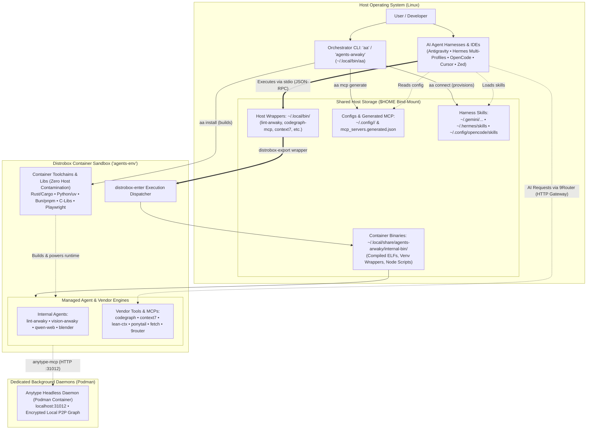

# agents-arwaky

<div align="center">

---

## 💡 Executive Summary

Modern autonomous AI workflows demand dozens of polyglot toolchains—Rust (`cargo`), Node (`pnpm`/`npm`), Bun, Python (`uv`), Playwright headless browsers, and system C-libraries. Installing these natively clutters the host operating system, introduces version conflicts, and creates security vulnerabilities.

**`agents-arwaky`** solves this through a **Distrobox First-Class Architecture**:

- 🛡️ **Zero Host Contamination:** Compilers, dependencies, and runtimes live inside an automated rootless container (`agents-env`). Your host OS stays clean.
- ⚡ **Seamless Host Execution:** Containerized executables are exported directly to `~/.local/bin/` via standard Linux XDG integration. Run tools from your host terminal with zero manual container switching.
- 🤖 **Universal MCP Hub & Skills Provisioner:** Out-of-the-box integration for AI harnesses (Google Antigravity, Hermes Agent with full multi-profile sync, OpenCode, Cursor, Zed) via declarative MCP configs and automated skill provisioning.
- 🎯 **Unified Orchestration (`agents-arwaky` / `aa` CLI):** One single control point for diagnostics, health checks, execution dispatching, and build pipelines.

---

## 📑 Table of Contents

- [Architecture](#-architecture)
  - [System Flow](#system-flow)
  - [Directory Layout](#directory-layout)
- [Quickstart in 60 Seconds](#-quickstart-in-60-seconds)
- [Unified Orchestrator CLI (`agents-arwaky` / `aa`)](#-unified-orchestrator-cli-agents-arwaky--aa)
- [Agent & Tool Catalog](#-agent--tool-catalog)
  - [Core In-House Agents (`internal/`)](#core-in-house-agents-internal)
  - [Curated Upstream Vendor Tools (`vendor/`)](#curated-upstream-vendor-tools-vendor)
- [MCP Client Integration](#-mcp-client-integration)
  - [Anytype Headless Daemon](#-anytype-headless-daemon-podman)
  - [Automated Harness Connector (`aa connect`)](#-automated-harness-connector-aa-connect)
  - [Manual Client Setup Guides](#manual-client-setup-guides)
- [Developer Workflows](#-developer-workflows--installation-paradigms)
  - [Interactive Container Shell](#interactive-container-shell)
  - [Host / Bare-Metal Fallback](#2-host-mode-bare-metal-fallback)
  - [Quality Gate & CI Verification](#quality-gate--ci-verification)
- [Security & Sandboxing Model](#-security--sandboxing-model)
- [Contributing](#-contributing)
- [License & Attribution](#-license--attribution)

---

## 🏛️ Architecture

### System Flow



### Directory Layout

```text
agents-arwaky/
├── agents-arwaky                # Main Orchestration Entrypoint CLI (alias: aa)
├── distrobox.ini                # Declarative container specification (Podman/Docker)
├── mcp_servers.generated.json   # Auto-generated unified MCP client manifest
├── AGENTS.md                    # Operational manual & architecture context for AI agents
├── CONTRIBUTING.md              # Contributor workflows (adding/removing vendor tools)
├── THIRD_PARTY_LICENSES.md      # Upstream licensing compliance records
├── LICENSE                      # Project License (MIT)
│
├── internal/                    # In-House Autonomous Agents & Tools
│   ├── blender-arwaky/          # Headless 3D pipeline & rendering execution engine
│   ├── lint-arwaky/             # Rust-based Architecture Enforcement System (AES)
│   ├── qwen-web-arwaky/         # Playwright-driven browser automation & MCP
│   └── vision-arwaky/           # Computer vision MCP (VLM, OCR, visual memory)
│
├── vendor/                      # Pinned Upstream Repositories (Git Submodules)
│   ├── 9router/                 # Local AI routing gateway & token saver
│   ├── anytype-mcp/             # Anytype desktop & sync integration
│   ├── codegraph/               # Codebase intelligence & graph query engine
│   ├── context7/                # Upstash documentation & context retrieval
│   ├── fetch-mcp/               # Fast, clean web scraping & text extraction
│   ├── lean-ctx/                # High-efficiency token-lean codebase indexer
│   └── ponytail/                # Agent architecture patterns & instructions
│
└── tools/                       # Orchestration, CI & XDG Infrastructure
    ├── arwaky/                  # CLI engine implementation & tool manifest
    ├── build/                   # Master cross-compilation pipeline
    ├── ci/                      # Quality gates & syntax validation scripts
    ├── distrobox/               # Container provisioning & binary exporter
    ├── lib/                     # Shared bash utilities & XDG path helpers
    ├── mcp/                     # Multi-client MCP configuration generator
    └── <vendor-tool>/           # Per-tool installation & wrapper definitions
```

---

## 🚀 Quickstart in 60 Seconds

### 1. Clone with Submodules

```bash
git clone --recurse-submodules https://github.com/rakaarwaky/agents-arwaky.git
cd agents-arwaky
```

> [!TIP]
> If you previously cloned without submodules, initialize them via:
>
> ```bash
> ./aa submodules
> ```

### 2. Verify Host Prerequisites

Ensure [Podman](https://podman.io/) (or Docker) and [Distrobox](https://distrobox.it/) are installed:

```bash
./aa setup
```

*(Runs an automated prerequisite check and optionally installs dependencies using your host package manager: `apt`, `pacman`, or `dnf`).*

### 3. Build & Provision (One-Command)

```bash
./aa install
```

This single command executes the end-to-end setup pipeline:

1. Validates host container runtime.
2. Creates the isolated `agents-env` Distrobox container from [`distrobox.ini`](distrobox.ini).
3. Provisions isolated runtimes (`uv`, `bun`, `pnpm`, `cargo`) inside the container.
4. Compiles all internal agents and vendor tools into containerized XDG prefixes.
5. Exports binary launchers to host `~/.local/bin/`.
6. Generates unified MCP configurations at `mcp_servers.generated.json`.

### 4. Verify System Health

```bash
aa doctor
aa status
```

---

## 💻 Unified Orchestrator CLI (`agents-arwaky` / `aa`)

The repository installs the `agents-arwaky` CLI and its short alias `aa` into `~/.local/bin/`. It serves as the single pane of glass for monitoring, executing, and managing all ecosystem components.

```
   ___                           _        
  / _ | _______    _____ _ / /____ __   
 / __ |/ __/ _ \/\/ _ `/  '_/ // /   
/_/ |_/_/  \_/\_/\_,_/_/\_\_, /  
                           /___/   
 agents-arwaky Unified Tool Orchestrator v1.0
```

### Command Reference


| Command                                  | Purpose                                                                                            | Example                                        |
| ------------------------------------------ | ---------------------------------------------------------------------------------------------------- | ------------------------------------------------ |
| `aa status`                              | Display health, installation state, and submodule readiness                                        | `aa status`                                    |
| `aa doctor`                              | Diagnose container runtime, PATH availability, and dependencies                                    | `aa doctor`                                    |
| `aa check`                               | Run quality gate verification (executable bits, JSON syntax, shellcheck, submodules)               | `aa check`                                     |
| `aa list`                                | List all registered tools (internal & vendor) with categories                                      | `aa list`                                      |
| `aa run <tool> [args]`                   | Transparently execute any tool inside the container from host                                      | `aa run context7 --help`                       |
| `aa mcp list`                            | Enumerate all tools offering Model Context Protocol servers                                        | `aa mcp list`                                  |
| `aa mcp show`                            | Inspect current generated unified MCP client manifest                                              | `aa mcp show`                                  |
| `aa mcp generate`                        | Rebuild unified client configuration (`mcp_servers.generated.json`)                                | `aa mcp generate`                              |
| `aa skill list`                          | Discover, audit, and provision skills across all tools                                             | `aa skill list`                                |
| `aa connect <harness>`                   | Bridge MCP & skills into agent harnesses (`--antigravity`, `--hermes`, `--opencode`, `--all`)      | `aa connect --all`                             |
| `aa install [tool] [--distrobox|--host]` | Install tools (Distrobox sandbox default, or host bare-metal)                                      | `aa install fetch` / `aa install fetch --host` |
| `aa anytype <action>`                    | Manage headless Anytype daemon (`start`, `stop`, `status`, `auth-key`, `space-join`, `space-list`) | `aa anytype status`                            |
| `aa shell`                               | Drop into an interactive shell inside the sandbox container                                        | `aa shell`                                     |
| `aa submodules`                          | Cleanly initialize or update all git submodules                                                    | `aa submodules`                                |
| `aa clean [--host|--all]`                | Remove build artifacts, host binaries, or full pristine reset                                      | `aa clean`                                     |
| `aa destroy`                             | Remove and reset Distrobox container`agents-env`                                                   | `aa destroy`                                   |

> [!TIP]
> You can use `agents-arwaky` or the short alias `aa` interchangeably for all commands!

### Practical Examples

```bash
# Codebase indexing with codegraph
aa run codegraph index .

# Architecture validation across the repository
aa run lint --help

# Token-lean repository context generation
aa run lean-ctx serve
```

---

## 📦 Agent & Tool Catalog

> [!TIP]
> The single source of truth (SSOT) for all tool registrations is [`tools/arwaky/manifest.json`](tools/arwaky/manifest.json). You can also run `aa list` or `aa mcp list` to inspect live tool status from the terminal.

### Core In-House Agents (`internal/`)

Specialized autonomous agents developed specifically for the `agents-arwaky` ecosystem:


| Agent / Tool                                     | Binary & Aliases                                                                      | Language & Stack    |             MCP?             | Description                                                                                                                                                                                    |
| -------------------------------------------------- | --------------------------------------------------------------------------------------- | --------------------- | :-----------------------------: | ------------------------------------------------------------------------------------------------------------------------------------------------------------------------------------------------ |
| **[lint-arwaky](internal/lint-arwaky/)**         | `lint-arwaky` (`la`, `lac`, `lint-arwaky-cli`, `lint-arwaky-mcp`, `lint-arwaky-tui`)  | Rust                |  **Yes** (`lint-arwaky-mcp`)  | Architecture Enforcement System (AES) validating 24 rules across Rust, Python, TypeScript. Exposes 5 MCP tools:`execute_command`, `get_config`, `health_check`, `list_commands`, `read_skill`. |
| **[vision-arwaky](internal/vision-arwaky/)**     | `vision-arwaky` (`va`, `vision-arwaky-cli`, `vision-arwaky-mcp`, `vision-arwaky-tui`) | Python /`uv`        | **Yes** (`vision-arwaky-mcp`) | Unified vision intelligence: VLM inspection, OCR extraction, and visual memory.                                                                                                                |
| **[qwen-web-arwaky](internal/qwen-web-arwaky/)** | `qwen-web-arwaky` (`qwa`, `qwc`, `qwen-web-cli`, `qwen-web-mcp`)                      | Python / Playwright |   **Yes** (`qwen-web-mcp`)   | Browser automation engine with bi-directional MCP interface.                                                                                                                                   |
| **[blender-arwaky](internal/blender-arwaky/)**   | `blender-arwaky` (`ba`, `blender-mcp`)                                                | Python / Blender    |    **Yes** (`blender-mcp`)    | Headless 3D procedural execution, asset generation, and rendering pipeline.                                                                                                                    |
| **[anytype-daemon](tools/anytype-mcp/daemon/)**  | `anytype-daemon.sh` (CLI: `aa anytype`)                                               | Bash / Podman       |              No              | Headless Anytype daemon managing local-first encrypted P2P space sync for`anytype-mcp`.                                                                                                        |

### Curated Upstream Vendor Tools (`vendor/`)

High-performance community tools integrated via Git submodules and sandboxed with isolated XDG prefixes:


| Tool            | Exported Binary                    | Source Repo                                                           |      Protocol      | Focus Area                                                              |
| ----------------- | ------------------------------------ | ----------------------------------------------------------------------- | :------------------: | ------------------------------------------------------------------------- |
| **context7**    | `context7-mcp`, `ctx7`             | [upstash/context7](https://github.com/upstash/context7)               |  CLI / MCP Server  | Rapid documentation retrieval and vector context ingestion.             |
| **codegraph**   | `codegraph-mcp`, `codegraph`       | [colbymchenry/codegraph](https://github.com/colbymchenry/codegraph)   |     CLI / MCP     | Graph-based codebase intelligence and semantic symbol indexing.         |
| **lean-ctx**    | `lean-ctx` (`_lc`, `_lc_compress`) | [yvgude/lean-ctx](https://github.com/yvgude/lean-ctx)                 |     CLI / MCP     | Ultra-low token overhead repository context extraction and shadowing.   |
| **fetch-mcp**   | `fetch-mcp`, `mcp-fetch`           | [zcaceres/fetch-mcp](https://github.com/zcaceres/fetch-mcp)           |     MCP Server     | Resilient web scraping, HTML cleaning, and Markdown transformation.     |
| **ponytail**    | `ponytail-mcp`                     | [DietrichGebert/ponytail](https://github.com/DietrichGebert/ponytail) |     MCP Server     | Senior-developer prompt instructions and agent behavioral patterns.     |
| **anytype-mcp** | `anytype-mcp`                      | [anyproto/anytype-mcp](https://github.com/anyproto/anytype-mcp)       |     MCP Server     | Local-first knowledge base & workspace synchronization.                 |
| **9router**     | `9router`                          | [decolua/9router](https://github.com/decolua/9router)                 | CLI / HTTP Gateway | Local AI routing gateway, token saver (RTK), and 40+ provider fallback. |

---

## 🔌 MCP Client Integration

`agents-arwaky` generates a standardized, unified MCP client configuration file during `aa install` or `aa mcp generate`:

📁 File Location: `mcp_servers.generated.json`

```json
{
  "mcpServers": {
    "context7": { "command": "context7-mcp" },
    "fetch": { "command": "fetch-mcp" },
    "lean-ctx": { "command": "lean-ctx" },
    "ponytail": { "command": "ponytail-mcp" },
    "anytype": {
      "command": "anytype-mcp",
      "env": {
        "ANYTYPE_API_BASE_URL": "http://127.0.0.1:31012",
        "OPENAPI_MCP_HEADERS": "{\"Authorization\":\"Bearer <YOUR_API_KEY>\", \"Anytype-Version\":\"2025-11-08\"}"
      }
    },
    "codegraph": {
      "command": "codegraph-mcp",
      "args": ["serve", "--mcp"]
    },
    "vision": { "command": "vision-arwaky-mcp" },
    "qwen-web": { "command": "qwen-web-mcp" },
    "blender": { "command": "blender-mcp" },
    "lint": { "command": "lint-arwaky-mcp" }
  }
}
```

### 🧠 Anytype Headless Daemon (Podman)

`agents-arwaky` includes a headless Anytype daemon powered by `anytype-cli` inside Podman so your AI agents have their own persistent local knowledge graph:

```bash
# 1. Start the headless daemon container
aa anytype start

# 2. Check daemon health and API status
aa anytype status

# 3. Generate API key (auto-updates .env and MCP config)
aa anytype auth-key "arwaky-agent-key"

# 4. Invite agent to your Anytype Space (from desktop app invite link)
aa anytype space-join "<your-invite-link>"

# 5. List joined spaces
aa anytype space-list
```

### 🔗 Automated Harness Connector (`aa connect`)

Instead of manually copying configurations, use `aa connect` to automatically inject all 10 MCP servers and provision 68+ skills into your agent harnesses:

```bash
# Connect to specific harness
aa connect --antigravity      # Google Antigravity (~/.gemini/antigravity-cli/mcp_config.json & skills/)
aa connect --hermes           # Hermes Agent (Main profile + auto-detects all multi-profiles)
aa connect --opencode         # OpenCode (~/.config/opencode/opencode.jsonc & skills/)

# Connect to all supported harnesses at once
aa connect --all

# Additional Flags:
aa connect --all --force      # Overwrite existing skill files and MCP entries
aa connect --all --dry-run    # Preview changes without modifying files
aa connect --all --mcp-only   # Configure only MCP servers (skip skills)
aa connect --all --skills-only# Provision only skills (skip MCP)
aa connect --all --env-only   # Inject only 9router environment variables
aa connect --clean            # Remove provisioned skills and MCP entries cleanly
```

> [!NOTE]
> **Hermes Multi-Profile Support:** `aa connect --hermes` automatically detects all profiles under `~/.hermes/profiles/<profile>/` (e.g., `currie`, `fangyuan`, `linus`, `tesla`) alongside the main profile, ensuring all agents share the full tool and skill suite.
> **Environment & Gateway:** `aa connect` also auto-injects `NINEROUTER_URL` and `NINEROUTER_KEY` into harness environments (`.env`) and desktop session configs (`~/.config/environment.d/9router.conf`).

### Manual Client Setup Guides

<details>
<summary><b>🤖 Google Antigravity (AGY CLI / IDE)</b></summary>

Add the servers to your `~/.gemini/antigravity-cli/mcp_config.json` or run `aa connect --antigravity`:

```json
{
  "mcpServers": {
    "lint": { "command": "lint-arwaky-mcp" },
    "codegraph": { "command": "codegraph-mcp", "args": ["serve", "--mcp"] },
    "context7": { "command": "context7-mcp" },
    "lean-ctx": { "command": "lean-ctx" },
    "fetch": { "command": "fetch-mcp" },
    "ponytail": { "command": "ponytail-mcp" },
    "vision": { "command": "vision-arwaky-mcp" },
    "qwen-web": { "command": "qwen-web-mcp" },
    "blender": { "command": "blender-mcp" }
  }
}
```

</details>

<details>
<summary><b>🪶 Hermes Agent (Multi-Profile)</b></summary>

Hermes configuration uses `~/.hermes/config.yaml` and profile-specific paths `~/.hermes/profiles/<profile>/config.yaml`. Run `aa connect --hermes` to configure automatically, or register under the `mcp_servers` section:

```yaml
mcp_servers:
  lint:
    command: lint-arwaky-mcp
  codegraph:
    command: codegraph-mcp
    args: ["serve", "--mcp"]
  context7:
    command: context7-mcp
  lean-ctx:
    command: lean-ctx
  fetch:
    command: fetch-mcp
  ponytail:
    command: ponytail-mcp
  vision:
    command: vision-arwaky-mcp
  qwen-web:
    command: qwen-web-mcp
  blender:
    command: blender-mcp
```

</details>

<details>
<summary><b>💻 OpenCode</b></summary>

Add to `~/.config/opencode/opencode.jsonc` or run `aa connect --opencode`:

```jsonc
{
  "mcp": {
    "lint": { "type": "local", "command": ["lint-arwaky-mcp"] },
    "codegraph": { "type": "local", "command": ["codegraph-mcp", "serve", "--mcp"] },
    "context7": { "type": "local", "command": ["context7-mcp"] },
    "lean-ctx": { "type": "local", "command": ["lean-ctx"] },
    "fetch": { "type": "local", "command": ["fetch-mcp"] },
    "ponytail": { "type": "local", "command": ["ponytail-mcp"] },
    "vision": { "type": "local", "command": ["vision-arwaky-mcp"] },
    "qwen-web": { "type": "local", "command": ["qwen-web-mcp"] },
    "blender": { "type": "local", "command": ["blender-mcp"] }
  }
}
```

</details>

<details>
<summary><b>⚡ Cursor</b></summary>

Add to `.cursor/mcp.json` or Cursor Global Settings > MCP:

```json
{
  "mcpServers": {
    "lint": { "command": "lint-arwaky-mcp" },
    "codegraph": { "command": "codegraph-mcp", "args": ["serve", "--mcp"] },
    "context7": { "command": "context7-mcp" },
    "lean-ctx": { "command": "lean-ctx" },
    "fetch": { "command": "fetch-mcp" }
  }
}
```

</details>

<details>
<summary><b>🟦 Zed Editor</b></summary>

Add to `~/.config/zed/settings.json`:

```json
{
  "context_servers": {
    "lint": { "command": "lint-arwaky-mcp" },
    "codegraph": { "command": "codegraph-mcp", "args": ["serve", "--mcp"] },
    "context7": { "command": "context7-mcp" },
    "lean-ctx": { "command": "lean-ctx" },
    "fetch": { "command": "fetch-mcp" }
  }
}
```

</details>

---

## 🛠️ Developer Workflows & Installation Paradigms

`agents-arwaky` strictly defines **Two Installation Paradigms Only** across all tools (both internal agents and vendor MCPs):

### 1. Distrobox Mode (Sandboxed / Default & Recommended)

Compiles runtimes and tools inside the rootless `agents-env` container, exporting clean binary launchers to `~/.local/bin/`. Zero host contamination.

```bash
# Install all tools in ecosystem:
aa install

# Install a specific tool (e.g. fetch, lint, vision, codegraph):
aa install fetch
```

### 2. Host Mode (Bare-Metal Fallback)

If running without container permissions (e.g. nested virtualization restrictions), tools can be compiled directly on the host using native runtimes into standard XDG directories:

```bash
# Install all tools directly on host:
aa install --host

# Install a specific tool directly on host:
aa install fetch --host
```

### Interactive Container Shell

To inspect the internal toolchains or debug builds inside the sandbox:

```bash
aa shell
```

### Quality Gate & CI Verification

To run automated integrity checks (executable permissions, JSON schema validity, submodules state, and ShellCheck):

```bash
aa check
```

> See [**`CONTRIBUTING.md` § Quality Verification & PR Process**](CONTRIBUTING.md#-quality-verification--pr-process) for details on validation checks and commit conventions.

### Clean & Reset Targets

```bash
# Remove build artifacts & generated configurations:
aa clean

# Remove exported host binaries (~/.local/bin) and data (~/.local/share):
aa clean --host

# Destroy the sandbox container (preserves your code and host config):
aa destroy

# Deep reset submodules and repository to pristine state:
aa clean --all
```

---

## 🔒 Security & Sandboxing Model

- **Rootless Container Execution:** All compilation and execution runs under the unprivileged host user namespace using Podman rootless semantics.
- **XDG Conformance & Storage Isolation:**
  - Real compiled binaries reside in container-internal storage: `${XDG_DATA_HOME}/agents-arwaky/internal-bin/` (`~/.local/share/agents-arwaky/internal-bin/`).
  - Host executable wrappers reside in `${XDG_BIN_HOME}/` (`~/.local/bin/`) as lightweight `distrobox-export` scripts.
  - Configurations reside in `${XDG_CONFIG_HOME}/<tool>/` (`~/.config/<tool>/`).
  - Data and reports reside in `${XDG_DATA_HOME}/<tool>/` (`~/.local/share/<tool>/`).
- **Pristine Host Toolchain (Zero Contamination):** Compilers, runtimes, package managers, and system libraries (`cargo`, `rustc`, `gcc`, `node`, `bun`, `uv`, `libssl-dev`) exist solely within the container's isolated root storage. Your host OS `/usr` and root filesystems remain completely untouched.
- **Submodule Isolation:** Upstream codebases are strictly tracked via Git submodules at pinned commits, preventing unsolicited upstream drift.

> [!NOTE]
> For the complete technical specifications on XDG storage paths, container isolation contracts, and Architecture Enforcement System (AES) rules, see [**`AGENTS.md` § System Philosophy & Core Invariants**](AGENTS.md#-system-philosophy--core-invariants).

---

## 🤝 Contributing

Contributions to internal agents, orchestration wrappers, and documentation are welcome!

- **AI Agents & Autonomous Assistants:** Please read [**`AGENTS.md`**](AGENTS.md) for operational boundaries, invariants, container execution rules, and directory standards.
- **Human Contributors & Developers:** Refer to [**`CONTRIBUTING.md`**](CONTRIBUTING.md) for detailed step-by-step workflows on:
  - Adding a new vendor tool or MCP server
  - Cleanly removing or deprecating vendor tools
  - Upgrading upstream submodules
  - Contributing to in-house agents under `internal/`
  - Quality verification gates (`aa check`)

### Quick Pull Request Checklist:

1. Fork the repository & create a feature branch (`git checkout -b feat/my-new-tool`).
2. Follow the step-by-step workflow in [`CONTRIBUTING.md`](CONTRIBUTING.md).
3. Run verification before committing:
   ```bash
   aa check
   ```
4. Commit using conventional commits (`git commit -m "feat(vendor): add my-new-tool"`).
5. Open a Pull Request.

---

## 📄 License & Attribution

- **Repository & Orchestration Code:** Licensed under the **[MIT License](LICENSE)** © 2026 rakaarwaky.
- **Third-Party Dependencies:** Upstream submodules are licensed by their respective original authors under open-source licenses (MIT, Apache 2.0, BSD). Full licensing attributions and copyright notices are maintained in **[THIRD_PARTY_LICENSES.md](THIRD_PARTY_LICENSES.md)**.
